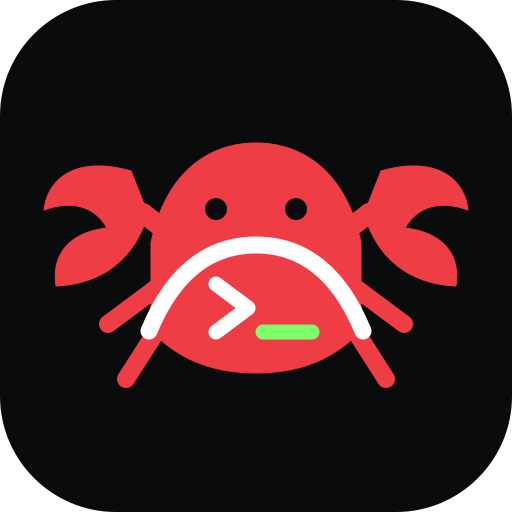
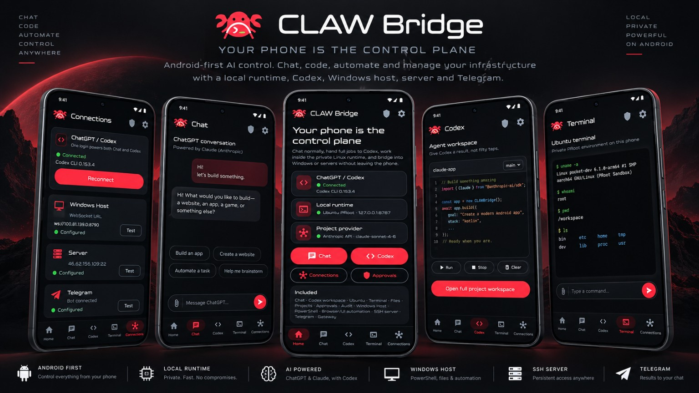
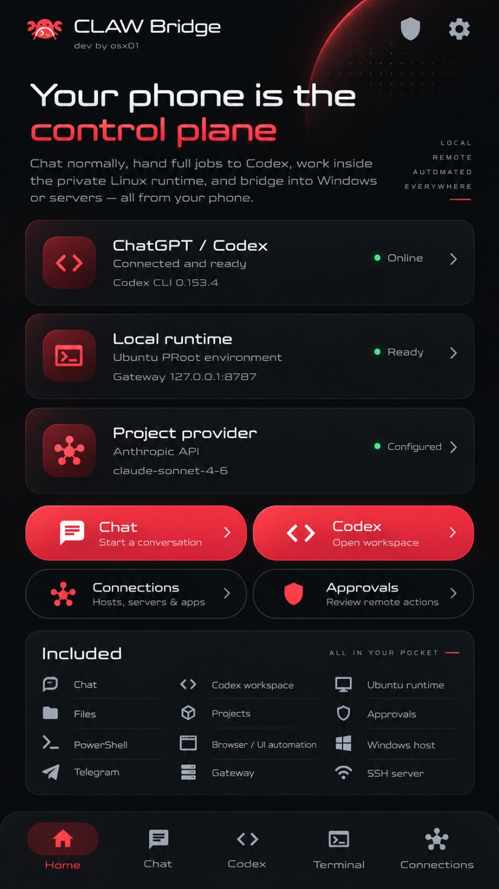
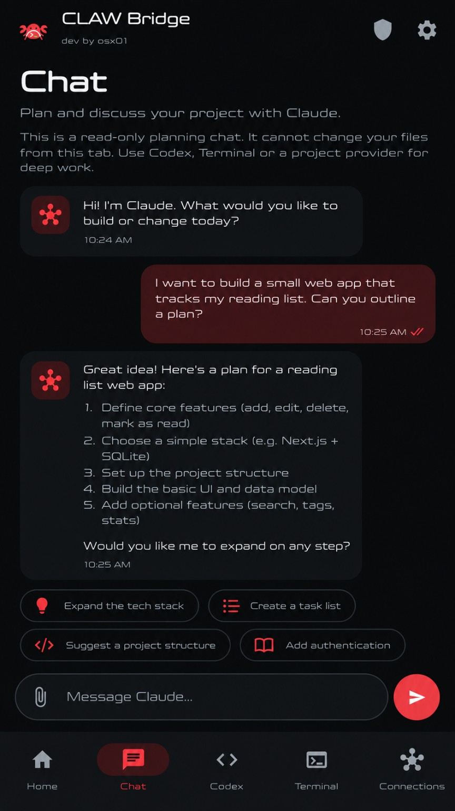
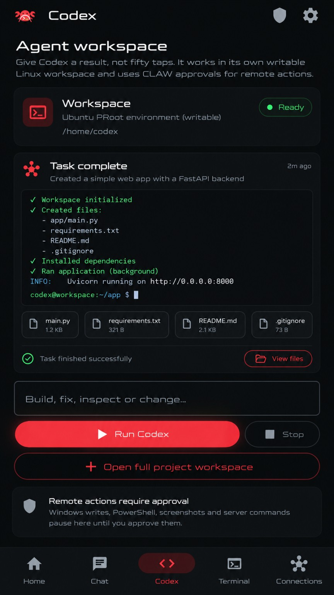
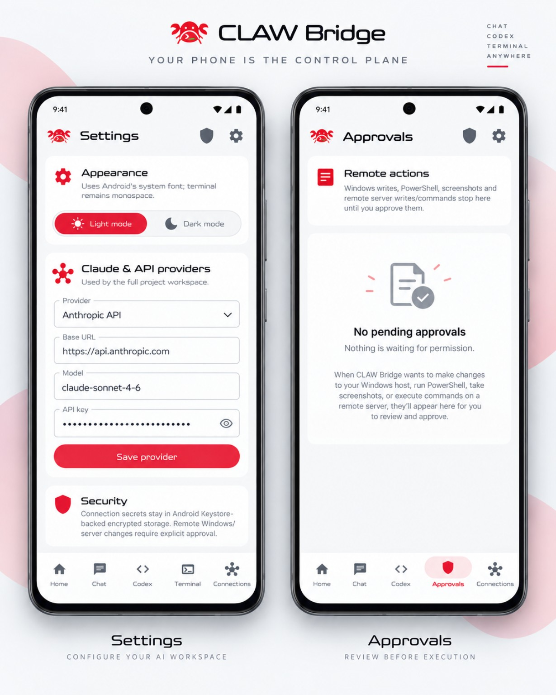

<p align="center">
  
</p>

<h1 align="center">CLAW Bridge</h1>

<p align="center">
  <strong>Your phone is the control plane.</strong><br>
  A pioneering Android-first AI agent harness for chat, code, automation and infrastructure.
</p>

<p align="center">
  <a href="https://github.com/levomm/claw-bridge/actions/workflows/android-apk.yml"></a>
  
  
  
</p>

<p align="center">
  <strong>BUILT FOR ANDROID — NOT A DESKTOP DASHBOARD SHRUNK ONTO A PHONE</strong>
</p>



> **Early beta.** CLAW Bridge is an independent project. It is not an official OpenClaw release.

## One phone. Every agent.

CLAW Bridge turns Android into the command center for AI agents and remote machines. Plan in chat, hand real work to Codex, operate a private Linux runtime, approve remote actions and connect Windows, servers or Telegram without leaving your phone.

| What makes it different | |
|---|---|
| **Android is the control plane** | The phone routes jobs, shows status, requests approval and keeps every target reachable. |
| **Agents have hands and feet** | Codex, Claude Code and shell tools can inspect files, run commands and complete real work. |
| **Human approval stays central** | Remote writes, PowerShell, screenshots and server commands can pause for explicit approval. |
| **Local-first by default** | The Termux gateway binds to `127.0.0.1`; secrets and runtime state stay on the device. |

## Interface

<table>
  <tr>
    <td width="50%" align="center">
      <br>
      <strong>Control plane</strong><br>
      <sub>Agents, runtime, connections and approvals in one view.</sub>
    </td>
    <td width="50%" align="center">
      <br>
      <strong>Chat</strong><br>
      <sub>Plan and discuss before handing work to an execution agent.</sub>
    </td>
  </tr>
  <tr>
    <td width="50%" align="center">
      <br>
      <strong>Codex workspace</strong><br>
      <sub>Run, inspect and change projects inside a writable workspace.</sub>
    </td>
    <td width="50%" align="center">
      <br>
      <strong>Settings & approvals</strong><br>
      <sub>Configure providers and review actions before execution.</sub>
    </td>
  </tr>
</table>

## Core surfaces

- **Chat** — planning and discussion without silently changing project files.
- **Codex** — writable project workspace with streamed task output.
- **Terminal** — mobile-first shell with sessions, history and shortcut keys.
- **Connections** — local runtime, Windows host, SSH server and Telegram endpoints.
- **Approvals** — deny, allow once or remember an accepted action.
- **Audit trail** — see what was requested, approved and executed.
- **APK + PWA** — native Android wrapper plus an installable browser interface.
- **IPv4 fallback** — local proxy for mobile networks with broken IPv6 routing.

## Architecture

| Layer | Runs where | Purpose |
|---|---|---|
| CLAW Bridge APK | Android | Dashboard, chat, workspaces, terminal, approvals and connections |
| Gateway | Termux | Token-authenticated WebSocket bridge and process control |
| Local runtime | Termux / proot | Writable Linux workspace and command execution |
| Remote hosts | Windows / SSH | Files, PowerShell, services and automation |
| Agents | Local or API-backed | Codex, Claude Code and configured providers |
| State | `~/.openclaw/` | Pairing token, PIDs, logs and audit trail |

In APK mode the frontend ships inside the app. Only the local gateway needs to run in Termux.

## Quick start on Android

Install a recent [Termux build from F-Droid](https://f-droid.org/packages/com.termux/), then:

```bash
git clone https://github.com/levomm/claw-bridge.git ~/CLAW-Bridge
cd ~/CLAW-Bridge
node gateway/claw.mjs install --gateway-only
claw up --gateway-only
claw status --gateway-only
claw pair
```

Healthy APK-mode output includes:

```text
gateway    HEALTHY
agent-ipv4 HEALTHY
```

Open the latest successful [Android APK workflow](https://github.com/levomm/claw-bridge/actions/workflows/android-apk.yml), download the artifact and install the APK. Pair it with:

```text
Gateway: ws://127.0.0.1:8787
Token:   shown by claw pair
```

### Browser/PWA mode

```bash
claw install
claw up
```

Open [http://127.0.0.1:3000/pair/](http://127.0.0.1:3000/pair/) on the same phone.

## CLI

```text
claw install [--gateway-only]
claw up [--gateway-only]
claw down [--gateway-only]
claw restart [--gateway-only]
claw status [--gateway-only]
claw logs [gateway|frontend] [-f]
claw pair
claw rotate-token
```

## Build and test

```bash
npm ci
npm --prefix gateway ci
npm --prefix gateway test
npx tsc --noEmit
env -u NODE_OPTIONS npm run build
npx cap sync android
```

Android compilation additionally requires Java 21 and the Android SDK:

```bash
cd android
./gradlew assembleDebug
```

Every push to `main` runs gateway tests, TypeScript checks, the web build and the Android APK build.

## Security model

- The gateway listens on `127.0.0.1` by default.
- Pairing uses a random 192-bit token stored with mode `0600`.
- Token comparison is constant-time.
- Startup logs do not print the token.
- Runtime directories, logs and PID files use restrictive permissions.
- Remote actions can be held for human approval.
- Anyone holding the pairing token can execute commands. Rotate exposed tokens immediately.
- Never publish port `8787` directly to the internet.

## Status

**Available now:** Android APK, Termux gateway, Codex/Claude/shell runs, terminal sessions, local pairing, approval flow and audit logging.

**In active development:** smoother onboarding, signed releases, richer Windows/SSH control, Telegram workflows and an optional official OpenClaw protocol adapter.

---

<p align="center">
  <br>
  <strong>CLAW Bridge</strong><br>
  <sub>Your agents. Your phone. Your control.</sub>
</p>
