<p align="center">
  
</p>

<h1 align="center">CLAW Bridge</h1>

<p align="center">
  <strong>Phone-first AI control plane for ChatGPT/Codex, Claude Code, Linux, Windows, servers and Telegram.</strong><br />
  Native Android runtime. Local approvals. Real tools. No Termux required for the native preview.
</p>

<p align="center"><sub>dev by osx01</sub></p>

---

## What CLAW Bridge is

CLAW Bridge turns an Android phone into an AI workspace and control surface. The native app owns a private Ubuntu PRoot runtime on-device, keeps agent actions behind an approval layer, and can extend into a paired Windows computer through CLAW Host.

The old Termux beta remains available during migration. The native preview installs side-by-side so we can verify the new stack on a real phone before replacing the existing app.

## Native v0.5 preview

The current `mobile-harness-integration` branch includes:

- Native Android app and private Ubuntu/Linux PRoot runtime
- CLAW Bridge launch branding and Android-native system typography
- Home, Chat, Codex, Terminal and Connections surfaces
- ChatGPT/Codex login through the Codex CLI device-auth flow
- Claude subscription plus Anthropic, OpenRouter, DeepSeek, Kimi and custom providers
- Projects, chats, files, project terminal, changes, preview and attachments
- Approval-gated agent actions and audit-friendly runtime events
- Local CLAW gateway on `127.0.0.1:8787`
- Windows CLAW Host for PowerShell, files, browser automation and Windows UI Automation
- SSH server connection testing
- Telegram bot connection testing
- Android build toolchains for web, Python, Android, C/C++ and PHP projects

## Architecture

```text
Android
┌───────────────────────────────────────────────┐
│ CLAW Bridge                                   │
│ Home · Chat · Codex · Terminal · Connections │
│                 │                             │
│        approvals / local gateway             │
│                 │                             │
│        private Ubuntu PRoot runtime           │
│     Codex · Claude Code · shell · build tools │
└───────────────────────────────────────────────┘
                 │
                 ├── Windows CLAW Host
                 │   PowerShell · files · browser · UI automation
                 │
                 ├── SSH servers
                 └── Telegram
```

See [`docs/NATIVE_ARCHITECTURE.md`](docs/NATIVE_ARCHITECTURE.md) for migration and security boundaries.

## Native preview build

Every push affecting `native/**` on `mobile-harness-integration` runs **Native Android APK**.

The workflow runs unit tests, builds the online native preview, and uploads the APK as a GitHub Actions artifact.

The native preview uses a separate package so it can be installed beside the current beta during verification.

## Windows CLAW Host

The Windows host is a separate companion service. It exposes only the tools configured by CLAW Bridge and keeps high-impact actions behind the phone approval model.

Included host capabilities:

- PowerShell
- filesystem operations
- browser automation
- Windows UI Automation

See [`host/README.md`](host/README.md).

## ChatGPT / Codex auth

The native preview uses the official Codex CLI login flow. In **Connections → ChatGPT / Codex OAuth**, the app starts Codex device authentication and keeps the resulting Codex session inside the private Linux runtime.

For devices where browser callback auth is awkward, device auth avoids depending on a localhost browser callback inside Android.

## Security model

- The local gateway remains loopback-only by default.
- Provider secrets are stored in Android secure storage where supported by the native provider layer.
- High-impact tool requests require approval.
- Windows computer actions go through the authenticated CLAW Host layer.
- Project preview blocks external navigation and is intended for localhost development servers.
- The Linux compatibility environment is useful isolation, but it is not marketed as a hardened hostile-code sandbox.

## Legacy Termux beta

The existing beta remains on `main` during native verification.

```bash
git clone https://github.com/levomm/openclaw-2.git ~/CLAW-Bridge
cd ~/CLAW-Bridge
node gateway/claw.mjs install
claw up
claw status
```

Same-device gateway: `ws://127.0.0.1:8787`

## Status

`mobile-harness-integration` is the active native migration branch. CI builds are required to pass before a preview APK is treated as installable. Real-device verification is still required before replacing the production package.

---

<p align="center"><strong>CLAW Bridge</strong><br /><sub>dev by osx01</sub></p>
