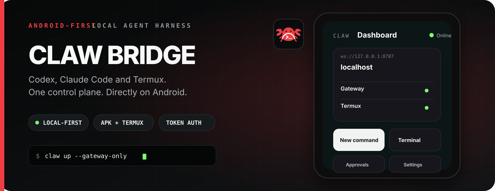
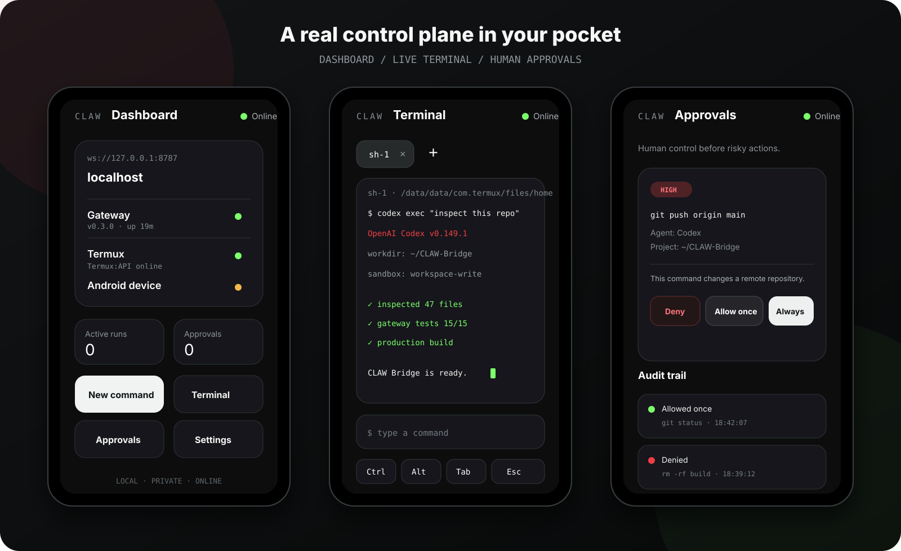

<p align="center">
  
</p>

<h1 align="center">CLAW Bridge</h1>

<p align="center">
  <strong>Android-first local AI agent harness.</strong><br>
  Run Codex, Claude Code and Termux from one control plane in your pocket.
</p>

<p align="center">
  <a href="https://github.com/levomm/claw-bridge/actions/workflows/android-apk.yml"></a>
  
  
  
</p>



> **Early beta.** CLAW Bridge is an independent project and is not an official OpenClaw release.

## Your phone becomes the control plane

CLAW Bridge puts a lightweight gateway in Termux and a touch-first control panel in an Android APK. The UI, terminal and approval flow stay on your phone; Codex and Claude Code run through their installed CLIs.

- **Live agent runs** — stream Codex, Claude Code and shell output.
- **Real Termux terminal** — multiple sessions, history and mobile shortcut keys.
- **Human approval gate** — deny, allow once or remember safe actions.
- **Local by default** — gateway binds to `127.0.0.1`, not the public internet.
- **One-command lifecycle** — PID files, health checks, logs and restart handling.
- **Android security** — pairing token plus biometric/device-lock gate.
- **IPv4 fallback** — local agent proxy for mobile networks with broken IPv6 routing.
- **APK + PWA** — use the native Android wrapper or the browser interface.



## How it fits together

| Layer | Runs where | Purpose |
|---|---|---|
| CLAW Bridge APK | Android | Dashboard, terminal, approvals and settings |
| Gateway | Termux | Authenticated WebSocket bridge and process control |
| Agents | Termux | Existing Codex and Claude Code CLI sessions |
| Runtime state | `~/.openclaw/` | Token, PIDs, logs and audit trail |

No Ubuntu/proot container is required. In APK mode the frontend is packaged inside the app, so port `3000` is unnecessary.

## Quick start on Android

Use a recent Termux build, preferably from [F-Droid](https://f-droid.org/packages/com.termux/). Then:

```bash
git clone https://github.com/levomm/claw-bridge.git ~/CLAW-Bridge
cd ~/CLAW-Bridge
node gateway/claw.mjs install --gateway-only
claw up --gateway-only
claw status --gateway-only
claw pair
```

Healthy APK-mode output includes:

```text
gateway    HEALTHY
agent-ipv4 HEALTHY
```

Install the APK from the latest successful [Android APK workflow](https://github.com/levomm/claw-bridge/actions/workflows/android-apk.yml), open CLAW Bridge and pair it with:

```text
Gateway: ws://127.0.0.1:8787
Token:   shown by claw pair
```

### Browser/PWA mode

To run both the gateway and browser interface:

```bash
claw install
claw up
```

Then open [http://127.0.0.1:3000/pair/](http://127.0.0.1:3000/pair/) on the same phone.

## CLI

```text
claw install [--gateway-only]
claw up [--gateway-only]
claw down [--gateway-only]
claw restart [--gateway-only]
claw status [--gateway-only]
claw logs [gateway|frontend] [-f]
claw pair
claw rotate-token
```

| Command | What it does |
|---|---|
| `claw up` | Starts services in the background and waits for health checks |
| `claw status` | Shows process, PID, port and health state |
| `claw logs gateway -f` | Follows the live gateway log |
| `claw pair` | Prints the same-device URL and pairing token |
| `claw rotate-token` | Invalidates the old token and creates a new one |

## Build and test

```bash
npm ci
npm --prefix gateway ci
npm --prefix gateway test
npx tsc --noEmit
env -u NODE_OPTIONS npm run build
npx cap sync android
```

Android compilation requires Java 21 and the Android SDK:

```bash
cd android
./gradlew assembleDebug
```

Every push to `main` runs gateway tests, TypeScript checks, the web build and the Android debug APK build.

## Security model

- The gateway listens on `127.0.0.1` by default.
- Pairing uses a random 192-bit token stored with mode `0600`.
- Token comparison is constant-time.
- Ordinary startup logs never print the token.
- Runtime directories, logs and PID files use restrictive permissions.
- The IPv4 agent proxy is loopback-only and restricts outbound tunnel destinations.
- Anyone holding the pairing token can execute commands. Rotate exposed tokens immediately.
- Never publish port `8787` directly to the internet.

## Current scope

CLAW Bridge is for developers who want a phone-native control surface for local coding agents. It is not trying to be another generic AI chat app.

**Now:** Android APK, Termux gateway, Codex/Claude/shell runs, live terminal, approvals, audit log and local pairing.

**Next:** signed releases, easier first-run setup, SSH/Windows targets, Telegram control and an optional official OpenClaw protocol adapter.

---

<p align="center">
  <strong>🦀 CLAW Bridge</strong><br>
  <sub>Your agents. Your phone. Your control.</sub>
</p>
